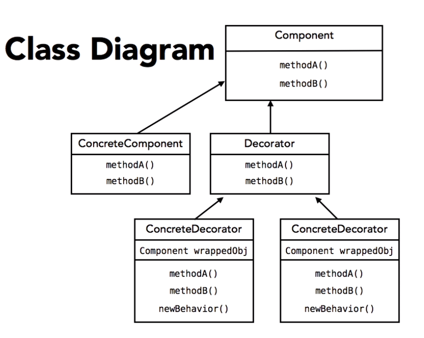

# Notes from the Course Programming Foundations: Design Patterns at [Lynda](https://lynda.com)

## *By using design patterns you are not reusing code, you are reusing **experience*** 

# Design Principles. 
## 1. *Encapsulate wath varies.*
Begin by identifying the parts of the code that may need to change in the future.

## 2. *Program to an interface, not an implementation.*
Try to stay away from specific implementations, make the code as generic as possible.

## 3. *Favor composition over inheritance.*
Most of the time composition leads to a more flexible and open to change design and to less mantainability issues.

## 4. *Strive for loosely coupled designs between objects that interact.*
This helps to design flexibility since any change in either side of the relationship won't be likely to break that relationhsip, the looser the objects are coupled, the lesser the probability for that breakup :)

## 5. *Open for extension, Closed to modification.*
This is one of the most important principles in software development, it refers to current objects, they should be open for the implementation of new features, however that new implementation should not interfere with current code that already works.

# Design Patterns.

## 1. The Strategy Pattern.
Prefer composition over inheritance, instead of passing behavior down to subclasses, use special interfaces for each piece of behavior and define specific behaviors as implementations of that interface, then in the Main class of the whole thing define instance variables for each behavior type, and assign that specific behavior your subclasses. 

## 2. The Observer Pattern.
Use this pattern if some object needs to notify other objects when it changes and pass it's data to the notified objects. 

Implement an isntance variable that holds a **list of Observers** in your **Observable** object; 

Add a `update(Observable o, Object data)` method to each **Observer**, this will be called by the **Observable** each time the data changes.

> The `Observable o` parameter is optional, use it in case the Observer keeps track of more than one Observable.  
> The `Object data` parameter is also optional in case you want to directly pass the new data to the Observable when it get's notified of changes.
 
Add these three methods to the **Observable**: 

- `registerObserver(Observer o)` to add an observer to the list.
- `removeObserver(Observer o)` to remove an observer from the list.
- `notifiObservers()` **iterate over the Observers** list and call the update method on each of them, optionally you can pass the new state of the Observable.

> There are a couple of helpers in java that'll help you with this pattern; The Observable class and the Observer interface.

## 3. The Decorator Pattern.
This pattern allows to add functionality without touching old funcitonal code, by spliting some implementation in a structure of abstract classes that shar the Supe Class with the objects to which we want to add the new funcitonality.

This pattern is better explained with a class diagram.

Now each `ConcreteComponent` instance can be wrapped in an undefined number of decorators and still be fully functional.

    Component component = new ConcreteComponent();

    // Because each decorator receives a Component type object there's no issue with passing an already decorated object, this is really powerful         
    component = new ConcreteDecorator1(component);
    component = new ConcreteDecorator2(component);
